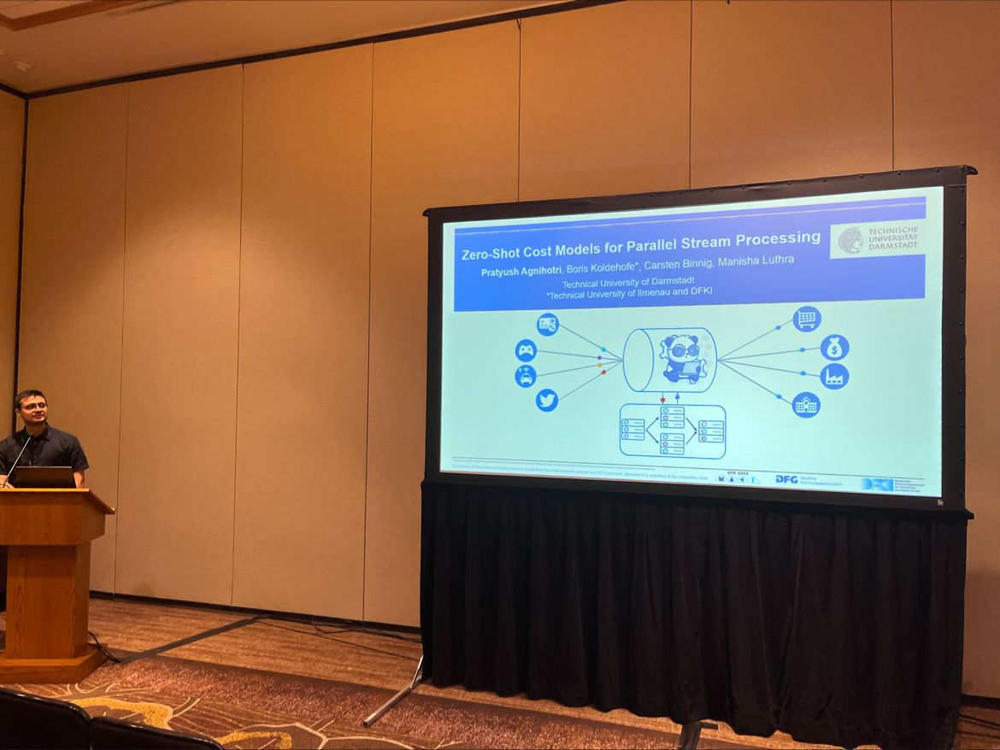

    

[SIGMOD 2023](https://2023.sigmod.org/)

🎉 Had an amazing time at Sigmod Conference! Delighted to present our paper titled "Zero-Shot Cost Models for Parallel Stream Processing" at aiDM@SIGMOD co-authored with Boris Koldehofe, Carsten Binnig and Manisha Luthra. I want to express my sincere gratitude to the conference organizers and steering committee members Rajesh Bordawekar, Oded Shmueli, Yael Amsterdamer, Donatella Firmani, and Andreas Kipf for providing us with this valuable opportunity and their valuable feedback. [Paper link](https://lnkd.in/eP4jDZA4)

## 👉 Get Started with [ZeroTune](https://github.com/pratyushagnihotri/ZeroTune)

