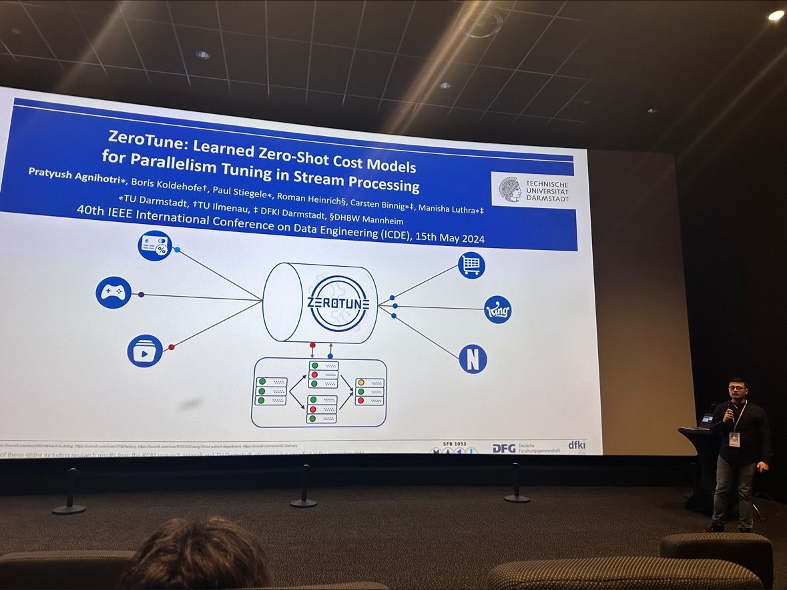

#```python
#from IPython.core.display import Image
#Image('https://www.python.org/static/community_logos/python-logo-master-v3-TM-flattened.png')
#```

    

    

#```python
#print("Welcome to Academic!")
#```

[ICDE 2024](https://icde2024.github.io/)

I had the incredible opportunity to present our paper, "ZeroTune- Learned Zero-Shot Cost Models for Parallelism Tuning in Stream Processing," at an A* venue IEEE ICDE Conference 2024 🎉

Our research focuses on developing novel zero-shot cost models for performance prediction and efficient parallelism tuning in stream processing systems. ZeroTune aims to accurately predict performance and generalize across unseen parallel query structures and heterogeneous resources, all while reducing computational costs and training effort through a data-efficient training strategy. This represents a significant advancement in the field of data stream processing, and I’m thrilled to have shared our findings with such an esteemed audience. You can refer our paper [here] (https://lnkd.in/eTjJHb_9).

